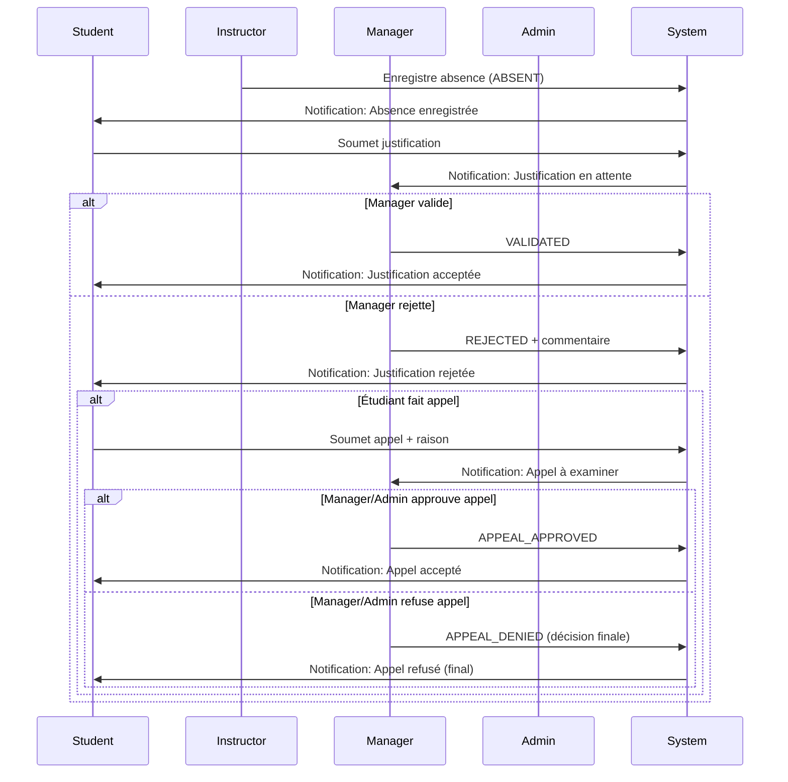
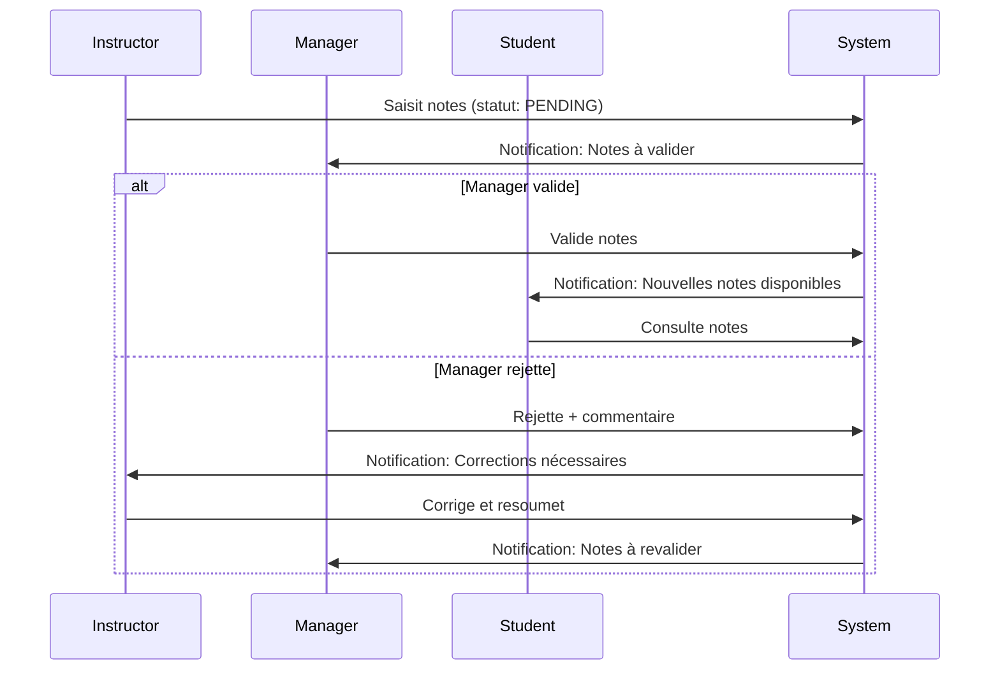
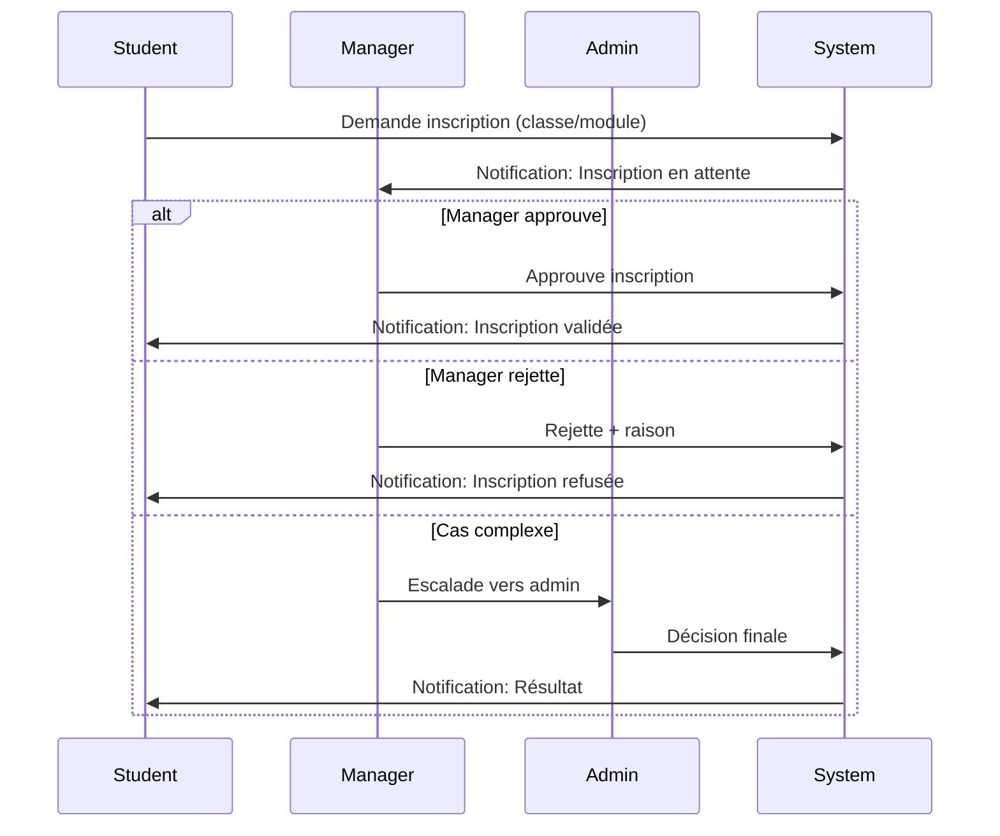

# 👥 Analyse des Rôles et Permissions - SMS

Analyse complète des rôles utilisateurs et de leurs permissions dans le système de gestion scolaire.

**Date**: 25 janvier 2026  
**Système**: SMS Microservices  
**Rôles**: 4 rôles principaux

---

## 📋 Table des matières

1. [Vue d'ensemble des rôles](#vue-densemble-des-rôles)
2. [Matrice des permissions](#matrice-des-permissions)
3. [Détail par rôle](#détail-par-rôle)
4. [Workflows de validation](#workflows-de-validation)
5. [Permissions par service](#permissions-par-service)

---

## Vue d'ensemble des rôles

### Hiérarchie des rôles

```
┌─────────────────────────────────────┐
│           ADMIN                     │  (Contrôle total système)
│         Super-utilisateur           │
└─────────────────────────────────────┘
               ↓
┌─────────────────────────────────────┐
│          MANAGER                    │  (Gestion académique)
│    Validation & Supervision         │
└─────────────────────────────────────┘
               ↓
┌─────────────────────────────────────┐
│        INSTRUCTOR                   │  (Enseignement)
│    Notes & Présences                │
└─────────────────────────────────────┘
               ↓
┌─────────────────────────────────────┐
│          STUDENT                    │  (Consultation)
│    Visualisation limitée            │
└─────────────────────────────────────┘
```

### Les 4 rôles principaux

| Rôle | Description | Nombre typique | Service principal |
|------|-------------|----------------|-------------------|
| **STUDENT** | Étudiant(e) | ~1000+ | Student Service |
| **INSTRUCTOR** | Enseignant(e) | ~50-100 | Instructor Service |
| **MANAGER** | Gestionnaire académique | ~10-20 | Manager Service |
| **ADMIN** | Administrateur système | ~2-5 | Admin Service |

---

## Matrice des permissions

### Légende
- ✅ **Accès complet** (Créer, Lire, Modifier, Supprimer)
- 📖 **Lecture seule**
- ✏️ **Lecture + Modification limitée**
- 🔒 **Aucun accès**
- 🎯 **Accès contextuel** (selon assignation)

### Vue globale

| Module / Fonctionnalité | STUDENT | INSTRUCTOR | MANAGER | ADMIN |
|-------------------------|---------|------------|---------|-------|
| **Authentification** |
| Connexion | ✅ | ✅ | ✅ | ✅ |
| Gestion utilisateurs | 🔒 | 🔒 | 🔒 | ✅ |
| **Structure Académique** |
| Départements | 📖 | 📖 | ✏️ | ✅ |
| Classes | 📖 | 📖 | ✅ | ✅ |
| Modules/Matières | 📖 | 📖 | ✏️ | ✅ |
| Offres de cours | 📖 | 📖 | ✅ | ✅ |
| Sessions (Emploi du temps) | 📖 | 📖 | ✅ | ✅ |
| **Étudiants** |
| Profil personnel | ✏️ | 🔒 | 📖 | ✅ |
| Profils autres étudiants | 🔒 | 📖 | 📖 | ✅ |
| Inscriptions | 📖 | 📖 | ✅ | ✅ |
| **Présences** |
| Voir ses présences | ✅ | 🔒 | 📖 | ✅ |
| Enregistrer présences | 🔒 | ✅ | 🔒 | ✅ |
| Justifier absence | ✅ | 🔒 | 🔒 | 🔒 |
| Valider justifications | 🔒 | 🔒 | ✅ | ✅ |
| Faire appel | ✅ | 🔒 | 🔒 | 🔒 |
| Examiner appels | 🔒 | 🔒 | ✅ | ✅ |
| Statistiques personnelles | ✅ | 🔒 | 🔒 | ✅ |
| Statistiques de classe | 🔒 | 📖 | ✅ | ✅ |
| **Notes/Évaluations** |
| Voir ses notes | ✅ | 🔒 | 🔒 | ✅ |
| Saisir notes | 🔒 | ✅ | 🔒 | ✅ |
| Valider notes | 🔒 | 🔒 | ✅ | ✅ |
| **Messagerie** |
| Envoyer messages | ✅ | ✅ | ✅ | ✅ |
| Recevoir messages | ✅ | ✅ | ✅ | ✅ |
| **Notifications** |
| Recevoir notifications | ✅ | ✅ | ✅ | ✅ |
| Notifications globales | 🔒 | 🔒 | 🔒 | ✅ |
| **Rapports** |
| Rapport personnel | ✅ | 🔒 | 🔒 | ✅ |
| Rapports de classe | 🔒 | 📖 | ✅ | ✅ |
| Rapports globaux | 🔒 | 🔒 | 📖 | ✅ |
| **Administration** |
| Configuration système | 🔒 | 🔒 | 🔒 | ✅ |
| Audit logs | 🔒 | 🔒 | 📖 | ✅ |
| Permissions | 🔒 | 🔒 | 🔒 | ✅ |
| Backups | 🔒 | 🔒 | 🔒 | ✅ |

---

## Détail par rôle

### 1. 🎓 STUDENT (Étudiant)

**Objectif**: Consulter son parcours académique et interagir avec le système pour ses besoins personnels.

#### Permissions détaillées

**✅ Peut faire :**
- Se connecter au système
- Consulter son profil (nom, email, numéro étudiant)
- Modifier certaines informations personnelles (adresse, téléphone)
- **Emploi du temps** :
  - Visualiser son emploi du temps hebdomadaire
  - Voir les détails des sessions (salle, instructeur, horaire)
- **Présences** :
  - Consulter son historique de présences
  - Voir ses statistiques (taux de présence)
  - Justifier ses absences (soumettre justification)
  - Faire appel si justification rejetée
- **Notes** :
  - Consulter ses notes par matière
  - Voir sa moyenne générale
  - Consulter son relevé de notes
- **Inscriptions** :
  - Voir ses inscriptions (classes, matières)
  - Consulter son statut (ACTIVE, INACTIVE, etc.)
- **Messagerie** :
  - Envoyer des messages aux instructeurs et managers
  - Recevoir et lire des messages
  - Supprimer ses propres messages
- **Notifications** :
  - Recevoir notifications (absences validées, notes publiées, etc.)
  - Marquer notifications comme lues
- **Rapports** :
  - Consulter son rapport de performance personnel

**🔒 Ne peut PAS faire :**
- Créer/modifier/supprimer des utilisateurs
- Gérer la structure académique (départements, classes, modules)
- Enregistrer les présences d'autres étudiants
- Valider des justifications
- Saisir ou modifier des notes
- Accéder aux données d'autres étudiants
- Accéder aux fonctions d'administration
- Créer des emplois du temps
- Valider des inscriptions

#### Cas d'usage typiques

**Scénario 1: Consultation quotidienne**
```
1. Login
2. Consulter emploi du temps du jour
3. Voir notifications (nouvelle note publiée)
4. Consulter ses notes
```

**Scénario 2: Justification d'absence**
```
1. Login
2. Consulter ses présences
3. Identifier absence non justifiée
4. Soumettre justification avec certificat médical
5. Attendre validation du manager
6. Si rejeté: faire appel avec explications
```

**Scénario 3: Communication**
```
1. Login
2. Envoyer message à l'instructeur pour question sur cours
3. Consulter réponse dans messagerie
```

---

### 2. 👨‍🏫 INSTRUCTOR (Enseignant)

**Objectif**: Gérer l'enseignement, enregistrer les présences et évaluer les étudiants.

#### Permissions détaillées

**✅ Peut faire :**
- **Structure académique** :
  - Consulter les départements, classes, modules, matières
  - Voir les offres de cours qui lui sont assignées
  - Consulter les emplois du temps
- **Étudiants** :
  - Voir la liste des étudiants dans ses classes
  - Consulter les profils étudiants (informations de base)
  - Voir les statistiques de classe
- **Présences** :
  - Enregistrer les présences pour ses cours (PRESENT, ABSENT, LATE, EXCUSED)
  - Modifier les présences enregistrées (correction d'erreurs)
  - Consulter l'historique des présences de ses classes
  - Voir les statistiques de présence par étudiant et classe
  - Consulter les justifications soumises (lecture seule)
- **Évaluations/Notes** :
  - Saisir les notes pour ses matières
  - Modifier les notes avant validation
  - Consulter les moyennes de classe
  - Générer des statistiques de performance
- **Messaging** :
  - Envoyer messages aux étudiants de ses classes
  - Envoyer messages aux managers et admins
  - Recevoir et répondre aux messages
- **Rapports** :
  - Consulter rapports de performance de ses classes
  - Voir les statistiques détaillées par étudiant dans ses cours

**🔒 Ne peut PAS faire :**
- Gérer utilisateurs (créer/modifier/supprimer)
- Modifier la structure académique (départements, modules)
- Valider les justifications d'absence (rôle du manager)
- Valider les notes (rôle du manager)
- Approuver les inscriptions
- Créer ou modifier les emplois du temps
- Accéder aux fonctions d'administration
- Voir les présences/notes de classes dont il n'est pas responsable

#### Cas d'usage typiques

**Scénario 1: Début de cours**
```
1. Login
2. Consulter emploi du temps
3. Accéder à la liste de présence pour la session
4. Enregistrer présence de chaque étudiant (PRESENT/ABSENT/LATE)
5. Sauvegarder → Événement KAFKA émis pour absents
```

**Scénario 2: Saisie de notes**
```
1. Login
2. Sélectionner matière et classe
3. Saisir notes pour examen/TD/TP
4. Enregistrer → Notes en statut PENDING
5. Attendre validation du manager
```

**Scénario 3: Consultation statistiques**
```
1. Login
2. Consulter rapport de sa classe
3. Identifier étudiants en difficulté (moyenne < 10)
4. Envoyer message personnalisé à l'étudiant
```

---

### 3. 👔 MANAGER (Gestionnaire Académique)

**Objectif**: Superviser, valider et gérer l'organisation académique.

#### Niveaux de managers

Le système supporte plusieurs niveaux de managers avec des responsabilités différentes :

| Niveau | Responsabilité | Scope |
|--------|---------------|-------|
| `HEAD_OF_DEPARTMENT` | Chef de département | Département entier |
| `ACADEMIC_DIRECTOR` | Directeur académique | Établissement |
| `PROGRAM_COORDINATOR` | Coordinateur programme | Programme spécifique |
| `YEAR_COORDINATOR` | Coordinateur année | Année académique (L1, L2, etc.) |
| `QUALITY_ASSURANCE_MANAGER` | Gestionnaire qualité | Transversal |
| `STUDENT_AFFAIRS_MANAGER` | Affaires étudiantes | Transversal |

#### Types de responsabilités configurables

```sql
-- Extrait de manager_responsibilities
responsibility_type:
- STUDENT_ENROLLMENT (Inscriptions)
- GRADE_VALIDATION (Validation notes)
- ATTENDANCE_MONITORING (Surveillance présences)
- SCHEDULE_MANAGEMENT (Gestion emplois du temps)
- BUDGET_APPROVAL (Approbation budget)
- STAFF_EVALUATION (Évaluation personnel)
- REPORT_GENERATION (Génération rapports)
- EXAM_COORDINATION (Coordination examens)

Permissions par responsabilité:
- can_approve: Peut approuver
- can_reject: Peut rejeter
- can_modify: Peut modifier
- can_view: Peut consulter
```

#### Permissions détaillées

**✅ Peut faire :**
- **Gestion utilisateurs** (limité):
  - Voir liste des utilisateurs de son périmètre
  - Désactiver/activer comptes (selon permissions)
- **Structure académique** :
  - Créer/modifier/supprimer classes de son département
  - Gérer les offres de cours
  - Créer et modifier emplois du temps
  - Assigner instructeurs aux matières
- **Étudiants** :
  - Voir tous les étudiants de son périmètre
  - Approuver/rejeter inscriptions
  - Modifier statut étudiant (ACTIVE, SUSPENDED, etc.)
  - Gérer les réinscriptions
- **Présences** :
  - Consulter toutes les présences de son périmètre
  - **Valider justifications** :
    - Approuver justifications (VALIDATED)
    - Rejeter justifications (REJECTED) avec commentaire
  - **Examiner appels** :
    - Approuver appels (APPEAL_APPROVED)
    - Refuser appels (APPEAL_DENIED)
  - Voir statistiques détaillées de présence
  - Identifier étudiants à risque (taux < seuil)
- **Notes** :
  - Voir toutes les notes de son périmètre
  - **Valider les notes** saisies par instructeurs
  - Rejeter notes incorrectes (retour à l'instructeur)
  - Publier les notes (les rendre visibles aux étudiants)
- **Rapports** :
  - Générer rapports de classe
  - Générer rapports par année académique
  - Consulter statistiques globales
  - Exporter données en CSV/Excel
- **Messaging** :
  - Communiquer avec tous (étudiants, instructeurs, admins)
  - Envoyer notifications de groupe
- **Validations** (workflow principal):
  - Valider/rejeter inscriptions
  - Valider/rejeter justifications d'absence
  - Approuver/rejeter appels d'étudiants
  - Valider/rejeter notes d'instructeurs

**🔒 Ne peut PAS faire :**
- Gérer la configuration système globale
- Créer/supprimer départements (réservé ADMIN)
- Accéder aux logs d'audit complets
- Gérer les backups système
- Modifier les permissions des rôles
- Accéder aux données hors de son périmètre

#### Cas d'usage typiques

**Scénario 1: Validation justifications**
```
1. Login
2. Consulter liste des absences en attente (PENDING)
3. Pour chaque absence:
   - Lire justification étudiant
   - Vérifier pièce jointe (certificat)
   - Décision: VALIDATED ou REJECTED
   - Ajouter commentaire
4. Sauvegarder → Notification envoyée à l'étudiant
```

**Scénario 2: Examen d'appel**
```
1. Notification: Nouvel appel reçu
2. Consulter détails appel
3. Voir historique (justification initiale, rejet, raison appel)
4. Décision: APPEAL_APPROVED ou APPEAL_DENIED
5. Ajouter commentaire détaillé
6. Sauvegarder → Notification finale à l'étudiant
```

**Scénario 3: Validation notes**
```
1. Notification: Notes en attente de validation
2. Consulter notes saisies par instructeur
3. Vérifier cohérence (pas de notes > 20, moyennes correctes)
4. Valider → Notes publiées aux étudiants
5. Ou rejeter → Retour à l'instructeur avec commentaire
```

**Scénario 4: Gestion emploi du temps**
```
1. Créer nouvelle session de cours
2. Assigner instructeur, salle, horaire
3. Publier → Visible aux étudiants et instructeur
```

---

### 4. 🔐 ADMIN (Administrateur)

**Objectif**: Administration complète du système, configuration et supervision globale.

#### Permissions détaillées

**✅ Peut faire (TOUT) :**
- **Gestion utilisateurs complète** :
  - Créer, modifier, supprimer utilisateurs
  - Changer rôles (STUDENT → INSTRUCTOR, etc.)
  - Activer/désactiver comptes
  - Réinitialiser mots de passe
  - Voir historique de connexions
- **Structure académique complète** :
  - Créer/modifier/supprimer départements
  - Gérer toutes les classes, modules, matières
  - Créer années académiques et semestres
  - Gérer tous les emplois du temps
- **Configuration système** :
  - Modifier configurations globales (délais, seuils, etc.)
  - Gérer les paramètres d'authentification (expiration JWT, etc.)
  - Configurer les intégrations externes
- **Permissions et sécurité** :
  - Définir permissions par rôle
  - Créer nouveaux rôles personnalisés
  - Gérer matrice d'autorisation
  - Configurer politiques de sécurité
- **Audit et logs** :
  - Consulter tous les logs d'audit
  - Filtrer par utilisateur, action, date
  - Exporter logs pour analyse
  - Voir actions de tous les managers
- **Notifications globales** :
  - Envoyer notifications broadcast à tous
  - Planifier notifications automatiques
  - Créer templates de notifications
- **Backups et maintenance** :
  - Créer backups de la base de données
  - Restaurer depuis backup
  - Voir l'historique des backups
- **Dashboard global** :
  - Statistiques temps réel (utilisateurs actifs, etc.)
  - Métriques système (CPU, mémoire, requêtes/sec)
  - Alertes sur problèmes système
- **Tous les autres accès** :
  - Accès complet à tous les services
  - Peut agir comme n'importe quel rôle
  - Contourner validations si nécessaire (urgences)

**🔒 Ne peut PAS faire :**
- Rien ! L'admin a tous les droits

#### Cas d'usage typiques

**Scénario 1: Création nouvelle année académique**
```
1. Login admin
2. Créer nouvelle année académique (2026-2027)
3. Créer semestres (S1: Sept-Jan, S2: Fév-Juin)
4. Activer l'année
5. Notifier tous les managers
```

**Scénario 2: Gestion utilisateur problématique**
```
1. Consulter logs d'audit
2. Identifier comportement suspect (tentatives connexion multiples)
3. Désactiver compte temporairement
4. Envoyer notification à l'utilisateur
5. Réinitialiser mot de passe
```

**Scénario 3: Configuration système**
```
1. Modifier délai expiration JWT (24h → 12h)
2. Ajuster seuil présence minimale (75% → 80%)
3. Configurer notifications automatiques
4. Tester changements
5. Documenter dans logs
```

**Scénario 4: Gestion permissions**
```
1. Créer nouveau rôle personnalisé "ASSISTANT_MANAGER"
2. Définir permissions:
   - Peut consulter présences (can_view: true)
   - Peut approuver justifications (can_approve: true)
   - Ne peut pas rejeter (can_reject: false)
3. Assigner rôle à utilisateurs sélectionnés
```

---

## Workflows de validation

### Workflow 1: Justification d'absence



### Workflow 2: Publication de notes



### Workflow 3: Inscription étudiant



---

## Permissions par service

### Identity Service (9000)

| Endpoint | STUDENT | INSTRUCTOR | MANAGER | ADMIN |
|----------|---------|------------|---------|-------|
| POST /api/auth/login | ✅ | ✅ | ✅ | ✅ |
| POST /api/auth/register | ✅ | ✅ | ✅ | ✅ |
| GET /api/users | 🔒 | 🔒 | 🎯 | ✅ |
| GET /api/users/{id} | 🔒 | 🔒 | 🎯 | ✅ |
| PUT /api/users/{id} | 🔒 | 🔒 | 🔒 | ✅ |
| DELETE /api/users/{id} | 🔒 | 🔒 | 🔒 | ✅ |

### Student Service (8086)

| Endpoint | STUDENT | INSTRUCTOR | MANAGER | ADMIN |
|----------|---------|------------|---------|-------|
| GET /api/students | 🔒 | 📖 | ✅ | ✅ |
| GET /api/students/{id} | 🎯 (soi) | 📖 | ✅ | ✅ |
| POST /api/students | 🔒 | 🔒 | ✅ | ✅ |
| PUT /api/students/{id} | 🎯 (limité) | 🔒 | ✅ | ✅ |
| DELETE /api/students/{id} | 🔒 | 🔒 | 🔒 | ✅ |
| GET /api/enrollments/student/{id} | 🎯 (soi) | 📖 | ✅ | ✅ |
| POST /api/enrollments | 🔒 | 🔒 | ✅ | ✅ |

### Attendance Service (9000)

| Endpoint | STUDENT | INSTRUCTOR | MANAGER | ADMIN |
|----------|---------|------------|---------|-------|
| GET /api/attendance/student/{id} | 🎯 (soi) | 📖 | ✅ | ✅ |
| POST /api/attendance | 🔒 | ✅ | 🔒 | ✅ |
| PUT /api/attendance/{id} | 🔒 | ✅ | 🔒 | ✅ |
| POST /api/attendance/{id}/justify | ✅ | 🔒 | 🔒 | 🔒 |
| GET /api/attendance/pending | 🔒 | 🔒 | ✅ | ✅ |
| PUT /api/attendance/{id}/validate | 🔒 | 🔒 | ✅ | ✅ |
| POST /api/attendance/{id}/appeal | ✅ | 🔒 | 🔒 | 🔒 |
| GET /api/attendance/appeals/pending | 🔒 | 🔒 | ✅ | ✅ |
| PUT /api/attendance/{id}/appeal/review | 🔒 | 🔒 | ✅ | ✅ |
| GET /api/attendance/student/{id}/statistics | 🎯 (soi) | 📖 | ✅ | ✅ |

### Academic Structure Service (9000)

| Endpoint | STUDENT | INSTRUCTOR | MANAGER | ADMIN |
|----------|---------|------------|---------|-------|
| GET /api/departments | 📖 | 📖 | 📖 | ✅ |
| POST /api/departments | 🔒 | 🔒 | 🔒 | ✅ |
| GET /api/class-groups | 📖 | 📖 | ✅ | ✅ |
| POST /api/class-groups | 🔒 | 🔒 | ✅ | ✅ |
| GET /api/sessions/classgroup/{id}/week/grouped | ✅ | ✅ | ✅ | ✅ |
| POST /api/sessions | 🔒 | 🔒 | ✅ | ✅ |

### Messaging Service (8091)

| Endpoint | STUDENT | INSTRUCTOR | MANAGER | ADMIN |
|----------|---------|------------|---------|-------|
| GET /api/messages/received/{userId} | 🎯 (soi) | 🎯 (soi) | 🎯 (soi) | ✅ |
| POST /api/messages | ✅ | ✅ | ✅ | ✅ |
| PATCH /api/messages/{id}/read | 🎯 (soi) | 🎯 (soi) | 🎯 (soi) | ✅ |
| DELETE /api/messages/{id} | 🎯 (soi) | 🎯 (soi) | 🎯 (soi) | ✅ |

### Report Service (8093)

| Endpoint | STUDENT | INSTRUCTOR | MANAGER | ADMIN |
|----------|---------|------------|---------|-------|
| GET /api/reports/students/{id} | 🎯 (soi) | 📖 | ✅ | ✅ |
| GET /api/reports/classes/{id} | 🔒 | 📖 | ✅ | ✅ |
| GET /api/reports/years/{id} | 🔒 | 🔒 | 📖 | ✅ |
| POST /api/reports/students/refresh | 🔒 | 🔒 | 🔒 | ✅ |

### Admin Service (8094)

| Endpoint | STUDENT | INSTRUCTOR | MANAGER | ADMIN |
|----------|---------|------------|---------|-------|
| Tous les endpoints /api/admin/* | 🔒 | 🔒 | 🔒 | ✅ |
| GET /api/admin/audit-logs | 🔒 | 🔒 | 📖 (limité) | ✅ |
| PUT /api/admin/config/{key} | 🔒 | 🔒 | 🔒 | ✅ |
| POST /api/admin/backup/create | 🔒 | 🔒 | 🔒 | ✅ |

---

## 📊 Résumé

### Actions clés par rôle

| Action | STUDENT | INSTRUCTOR | MANAGER | ADMIN |
|--------|---------|------------|---------|-------|
| Se connecter | ✅ | ✅ | ✅ | ✅ |
| Consulter emploi du temps | ✅ | ✅ | ✅ | ✅ |
| Enregistrer présences | ❌ | ✅ | ❌ | ✅ |
| Justifier absences | ✅ | ❌ | ❌ | ❌ |
| Valider justifications | ❌ | ❌ | ✅ | ✅ |
| Examiner appels | ❌ | ❌ | ✅ | ✅ |
| Saisir notes | ❌ | ✅ | ❌ | ✅ |
| Valider notes | ❌ | ❌ | ✅ | ✅ |
| Gérer inscriptions | ❌ | ❌ | ✅ | ✅ |
| Créer emplois du temps | ❌ | ❌ | ✅ | ✅ |
| Gérer utilisateurs | ❌ | ❌ | ❌ | ✅ |
| Configuration système | ❌ | ❌ | ❌ | ✅ |

### Niveaux d'accès aux données

**STUDENT** :
- 🎯 **Ses propres données uniquement**
- 📖 **Lecture publique** (emplois du temps, liste cours)

**INSTRUCTOR** :
- 📖 **Ses classes assignées**
- ✏️ **Modification limitée** (présences, notes de ses cours)

**MANAGER** :
- 📖 **Son périmètre** (département, année, etc.)
- ✅ **Validation et administration** de son périmètre

**ADMIN** :
- ✅ **Accès universel**
- 🔧 **Configuration globale**

---

**Date**: 25 janvier 2026  
**Système**: SMS Microservices  
**Rôles définis**: 4 (STUDENT, INSTRUCTOR, MANAGER, ADMIN)
